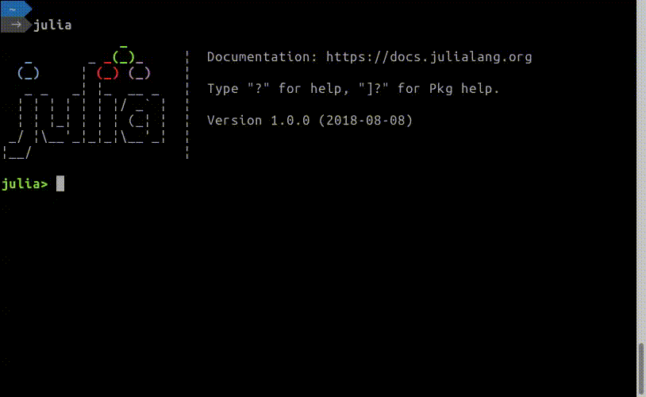

# GameOfLife

[Conway's Game of Life](https://en.wikipedia.org/wiki/Conway%27s_Game_of_Life)

This package is tested on Julia 1.0.0.

# Installation
```julia
(v1.0) pkg> add https://github.com/goropikari/GameOfLife.jl
```

# Example
```julia
using Pkg
Pkg.pkg"add https://github.com/goropikari/GameOfLife.jl"
using GameOfLife
game()

row,col = 20, 30
game(Gol(row, col, isperiodic=true, generations=50))

game2() # choose field size from options.
```



Glider gun sample
```julia
Pkg.test("GameOfLife")
```
